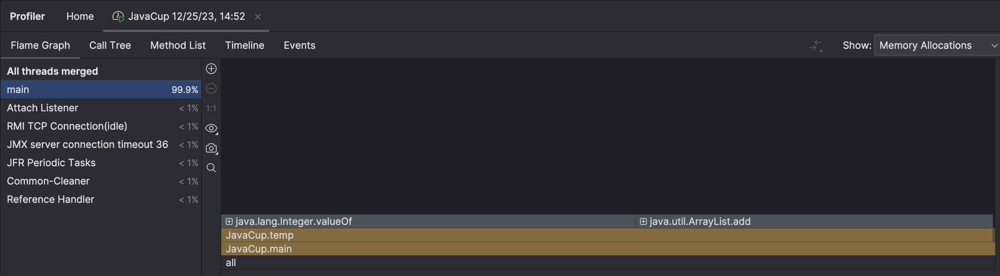
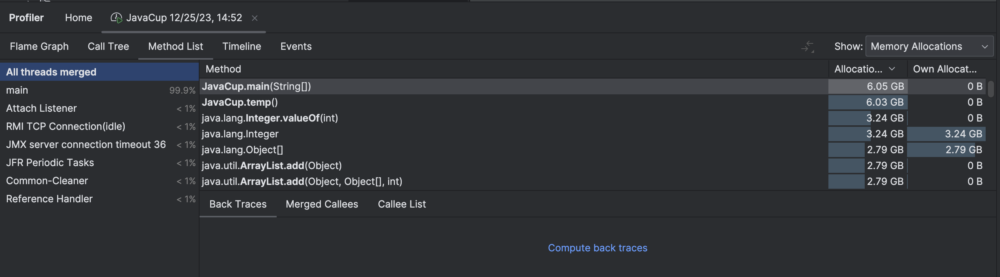
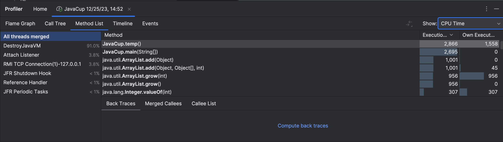
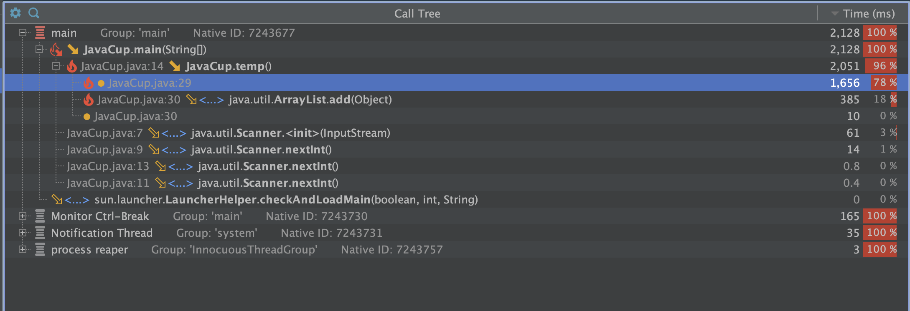
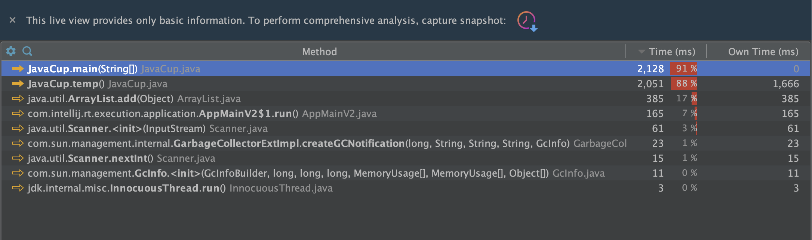
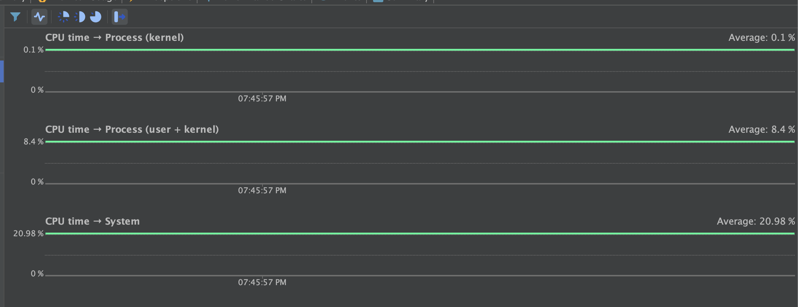
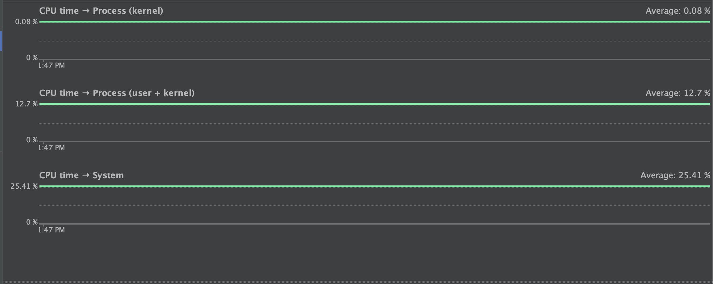
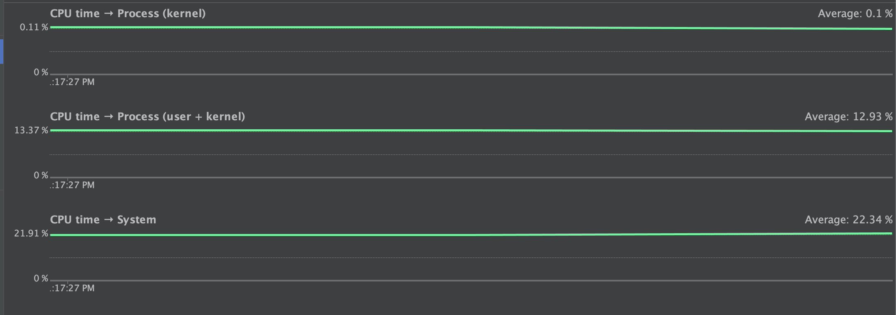

# Profiling using YourKit in Java 
در این تمرین با استفاده از بررسی منابع استفاده شده توسط هر تابع، سعی میکنیم کد را بهینه کنیم. 

پس از انجام مراحل موجود در دستورکار، برنامه را اجرا میکنیم. خروجی به صورت زیر است.












## پرسش اول

همانطور که در تصاویر دوم و سوم مشخص است، تابع temp بیشترین مقدار پردازنده و مموری را استفاده میکند. 

این تابع تاثیری در عملکرد برنامه ندارد، در نتیجه میتوان آن را کامل حذف کرد. اما برای آنکه کد را بهینه کنیم، به صورت زیر عمل میکنیم. 
میدانیم که استفاده از ArrayList با طول نامشخص بهینه نیست. در نتیجه تا جایی که ممکن است باید از آرایه های با طول ثابت استفاده کنیم. 

همچنین میتوان دو حلقه تودرتو را تبدیل به یک حلقه کرد. البته تاثیر زیادی در پرفورمنس ندارد و تغییر عمده برای تبدیل اری لیست به آرایه عادی است. 


```java
public static void temp1(){
        int [] a = new int[10000*20000];
        for (int i = 0; i < 10000 * 20000; i++) {
            int j = i % 20000;
            int sum = (i / 20000) + j;
            a[i] = sum;
        }
    }
```

حال خروجی های پروفایلر را بررسی میکنیم و تغییر کاملا مشهود است. 



همانطور که در تصویر بالا مشهود است، منابع کمتری پس از اعمال این تغییر استفاده شده است. 

## سوال دوم 

در این بخش پس از بررسی الگوریتم های قابل پیاده، الگوریتم فیبوناچی را به دو روش پیاده سازی کردم. در ابتدا با استفاده از برنامه بازگشتی مقدار خروجی را محاسبه میکنیم. به صورتی که برای عبارت f(x)=f(x-1)+f(x-2)دوبار طبق رابطه بازگشتی مقادیر را حساب کرده و باهم جمع میکنیم. کد آن مشابه زیر میشود. 

```java
public class NewFunction {

    public static long fibonacci(int n) {
        if (n <= 1) {
            return n;
        } else {
            return fibonacci(n - 1) + fibonacci(n - 2);
        }
    }

    public static void main(String[] args) {
        int n = 30;
        long a = fibonacci(n);
        System.out.println(a);

    }
}
```

مقدار مصرف منابع آن به صورت زیر است: 



حال محاسبه فیبوناچی را به کمک کد زیر محاسبه میکنیم. 


```java
    public static long fibonacci2(int n){
        if (n <= 1) {
            return n;
        }

        long[] dp = new long[n + 1];
        dp[0] = 0;
        dp[1] = 1;

        for (int i = 2; i <= n; i++) {
            dp[i] = dp[i - 1] + dp[i - 2];
        }
        return dp[n];
    }
```

انطور که در تصویر زیر قابل مشاهده است، مقدار مصرف cpu به طرز چشکگیری کاهش پیدا کرده است. 



نکته قابل توجه آن است که وقتی به ازای n=30 کد اول را اجرا میکردیم مدت زمان زیادی طول میکشید تا خروجی دهد. همچنین برای مقادیر بزرگتر استک پر میشد و اجرا پایان نمی یافت. اما در کد دوم در صورتی که با n=30 اجرا میکردیم پروفایلینگ بهدلیل کوچک بودن زمان اجرا خروجی نداشت و از مقادیر بزرگتر استفاده کردیم. با این وجود مقدار مصرف پردازنده کمتر از جالت اول بود. 